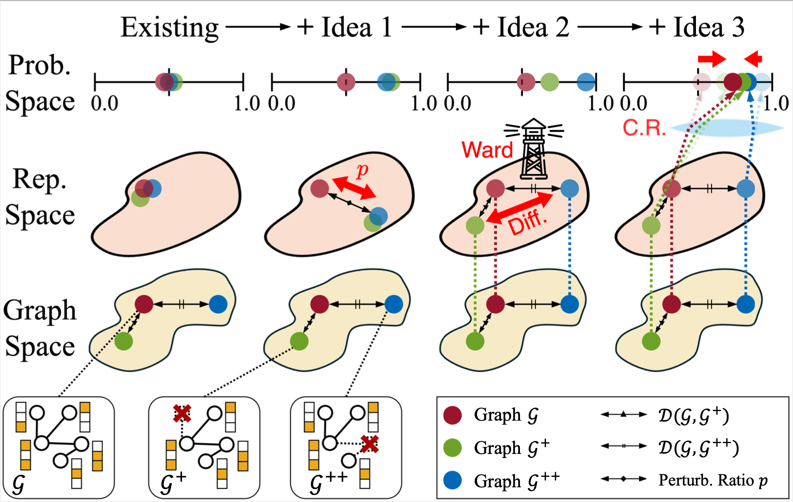

# AugWard: Augmentation-Aware Representation Learning for Accurate Graph Classification

This project is a PyTorch implementation of [**"AugWard: Augmentation-Aware Representation Learning for Accurate Graph Classification"**]() (PAKDD 2025).
The paper proposes AugWard, a novel graph representation framework that carefully considers the diversity introduced by graph augmentation.



## Prerequisites

Our implementation is based on Python and PyTorch Geometric.

- Python 3.9.12
- PyTorch 2.1.0
- PyTorch Geometric 2.4.0

We include `requirements.txt`, which contains all the packages used for the experiment. 
We checked the dependency using a workstation with CUDA 11.6 installed.
Install the required packages with the following code:

```shell
pip install -r requirements.txt
```

## Usage
We include `run.sh`, which reproduces the graph classification result on PTC_MR dataset.

```shell
bash run.sh
```

To run with different settings, change the arguments passed into `src/run.py`.
Check the terminal and `src/results/` folder for the results.

### Datasets

We utilize 10 datasets in our work on graph classification task, which are all from the [Datasets Source](https://chrsmrrs.github.io/datasets/).
The datasets could be easily downloaded using PyTorch Geometric.

| **Dataset** |  **Category**  | **Graphs** | **Nodes** | **Edges** | **Features** | **Labels** |
|-------------|:--------------:|-----------:|----------:|----------:|-------------:|-----------:|
| DD          | Bioinformatics | 1,178      | 284.32    | 715.66    | 89           | 2          |
| ENZYMES     | Bioinformatics | 600        | 32.63     | 62.14     | 3            | 6          |
| IMDB-B      | Social         | 1,000      | 19.77     | 96.53     | 65           | 2          |
| IMDB-M      | Social         | 1,500      | 13.00     | 65.94     | 59           | 3          |
| NCI1        | Molecules      | 4,110      | 29.87     | 32.30     | 37           | 2          |
| NCI109      | Molecules      | 4,127      | 29.68     | 32.13     | 38           | 2          |
| PROTEINS    | Bioinformatics | 1,113      | 39.06     | 72.82     | 18           | 2          |
| PTC-MR      | Molecules      | 334        | 14.29     | 14.69     | 3            | 2          |
| REDDIT-B    | Social         | 2,000      | 429.63    | 497.75    | 566          | 2          |
| TWITTER     | Social         | 144,033    | 4.03      | 4.98      | 1,323        | 2          |

***Note: The values for Nodes and Edges are average values per each graph instance.***

### Code Description

This repository is written based on the codes from **"Model-Agnostic Augmentation for Accurate Graph Classification"** (WWW '22) \[[GitHub](https://github.com/snudatalab/GraphAug)\].
<!-- We provide an overview of this repository as below:

``` Unicode
AugWard/
│
├── images/
│   ├── augward.png                 # the main ideas of AugWard
│   └── KimCLJK25.bib               # bib file    
|
├── src/
│   ├── augment/
│   │   ├── __init__.py               # codes for graph augmentation
│   │   ├── graphcl.py                # codes for NodeDrop, EdgePert
│   │   ├── submix.py                 # codes for SubMix
│   │   └── utils.py                  # code snippets for augmentation
│   │
│   ├── loss/
│   │   ├── __init__.py               # codes for losses
│   │   ├── celoss.py                 # codes for cross entropy loss
│   │   └── target.py                 # codes for target loss
│   │
│   ├── main/
│   │   ├── main_augward.py           # codes for AugWard
│   │   └── main_augplain.py          # codes for training with augmentation
│   │
│   ├── data.py                       # codes for datasets
│   ├── gin.py                        # codes for GIN
│   ├── run.py                        # codes for running AugWard
│   └── utils.py                      # frequently used code snippets
│
├── .gitignore                        # gitignore file
├── LICENSE                           # license for the use of the code
├── README.md                         # readme file
├── requirements.txt                  # required python packages
└── run.sh                            # a working demo of the results                      

``` -->

## Citation
You can download [this bib file](./images/KimCLJK25.bib) or copy the following information:

```bibtex
@inproceedings{KimCLJK25,
    title={AugWard: Augmentation-Aware Representation Learning for Accurate Graph Classification},
    author={Kim, Minjun and Choi, Jaehyeon and Lee, Seungjoo and Jung, Jinhong and Kang, U},
    booktitle={The 29th Pacific-Asia Conference on Knowledge Discovery and Data Mining},
    year={2025}
}
```